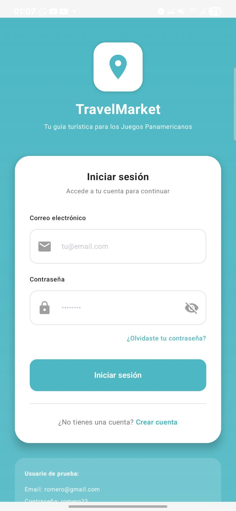
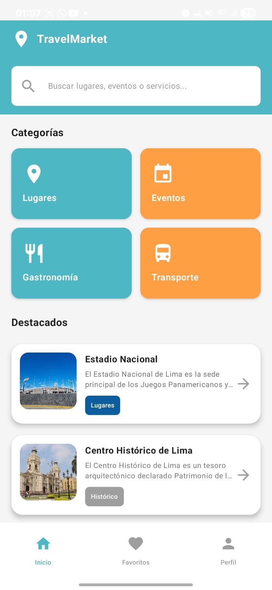
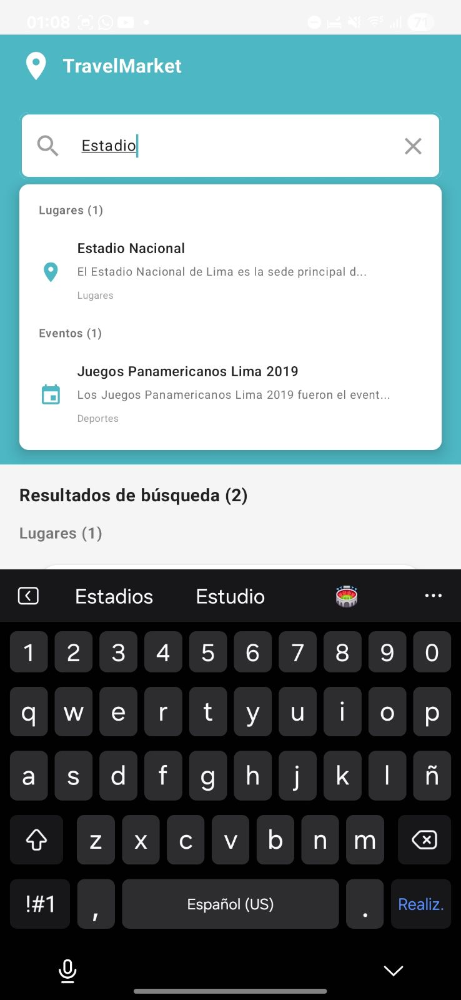
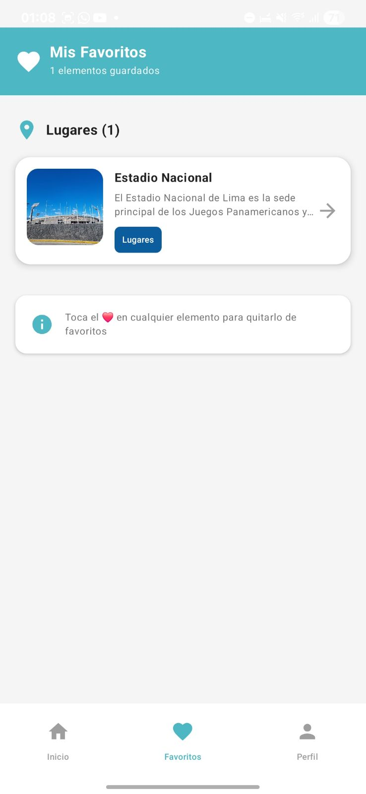
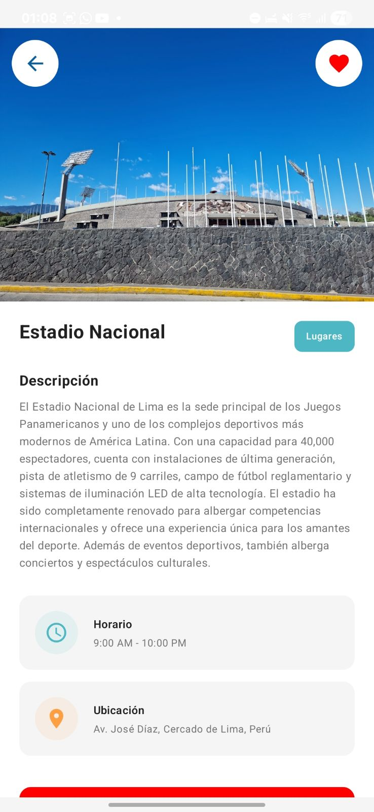
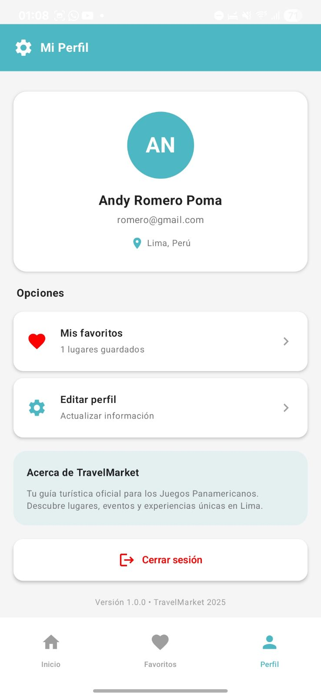

# 🧳 TravelMarket

Una aplicación móvil desarrollada en **Android** con **Kotlin** y **Jetpack Compose** para el mercado de viajes y turismo en Lima, Perú.

---

## 📱 Descripción del Proyecto

**TravelMarket** es una aplicación móvil nativa para Android que sirve como guía turística oficial para los **Juegos Panamericanos Lima 2019**. La aplicación permite a turistas y residentes descubrir y explorar:

- **🏛️ Lugares Turísticos**: Monumentos históricos, museos, parques y atracciones emblemáticas de Lima
- **🎉 Eventos**: Festivales, conciertos, eventos deportivos y actividades culturales
- **🍽️ Gastronomía**: Restaurantes, cafés, bares y experiencias culinarias peruanas
- **🚌 Transporte**: Servicios de transporte público, taxis, alquiler de bicicletas y opciones de movilidad

La app ofrece una experiencia moderna con navegación, búsqueda en tiempo real, sistema de favoritos y perfiles de usuario.

---

## 🎨 Diseño UI/UX

El diseño de la interfaz fue creado en **Figma** con un sistema de diseño consistente basado en Material 3:

🔗 **[Ver Prototipo en Figma](https://www.figma.com/make/Utm7dvakGC5enLc3s1vUl6/TravelMarket-Mobile-App-Prototype?node-id=0-1&t=sgp4vTMMvnVvR0db-1)**

### Paleta de Colores
- **Turquesa Primario**: `#4DB8C4` (Lugares, Gastronomía)
- **Naranja Secundario**: `#FF9F43` (Eventos, Transporte)
- **Azul Acento**: `#0B5D9E` (Detalles y acciones)

---

## 📸 Capturas de Pantalla

### Pantalla de Login


### Pantalla Principal (Home)


### Búsqueda en Tiempo Real


### Pantalla de Favoritos


### Detalle de Lugar


### Perfil de Usuario


---

## ✅ Funcionalidades Implementadas

### 🔐 Autenticación y Gestión de Usuarios
- [x] Sistema de login con validación de credenciales
- [x] Registro de nuevos usuarios con validación de datos
- [x] Perfil de usuario personalizado con avatar generado por iniciales
- [x] Edición de perfil (nombre, email) con validación en tiempo real
- [x] Cierre de sesión seguro con confirmación
- [x] Persistencia de sesión de usuario

### 🏠 Navegación y Pantallas Principales
- [x] Pantalla principal (Home) con categorías destacadas
- [x] Navegación inferior con 3 secciones: Inicio, Favoritos, Perfil
- [x] Navegación fluida entre pantallas con Navigation Compose
- [x] Transiciones y animaciones suaves
- [x] Gestión del back stack correcta

### 🔍 Búsqueda y Exploración
- [x] Barra de búsqueda en tiempo real con resultados instantáneos
- [x] Búsqueda unificada en lugares, eventos y servicios
- [x] Filtrado inteligente por nombre, descripción, ubicación y categoría
- [x] Resultados agrupados por tipo con contador
- [x] Navegación directa a detalles desde resultados de búsqueda

### 📍 Contenido y Categorías
- [x] **Lugares Turísticos**: 20 lugares emblemáticos de Lima con descripciones detalladas
- [x] **Eventos**: 12 eventos culturales, deportivos y gastronómicos
- [x] **Gastronomía**: 20 servicios gastronómicos (restaurantes, cafés, bares)
- [x] **Transporte**: Servicios de movilidad (Metropolitano, taxis, bicicletas)
- [x] Pantallas dedicadas por categoría con scroll infinito
- [x] Imágenes de alta calidad con Coil (carga desde URL) y locales

### ⭐ Sistema de Favoritos
- [x] Agregar/quitar favoritos con toggle reactivo
- [x] Pantalla dedicada de favoritos con agrupación por tipo
- [x] Contador de favoritos en tiempo real
- [x] Persistencia de favoritos durante la sesión
- [x] Estado vacío con llamado a la acción cuando no hay favoritos
- [x] Sincronización de estado entre pantallas

### 📄 Detalles de Elementos
- [x] Pantalla de detalle unificada para lugares, eventos y servicios
- [x] Visualización de imágenes en tamaño completo
- [x] Información detallada: descripción, horario, ubicación
- [x] Badge de categoría con código de colores
- [x] Botón de favoritos integrado
- [x] Botones de acción primarios y secundarios

### 🎨 Interfaz de Usuario (UI/UX)
- [x] Material Design 3 con tema personalizado
- [x] Paleta de colores consistente (Turquesa y Naranja)
- [x] Componentes reutilizables (ItemCard, SearchBar, BottomNav)
- [x] Diseño responsive adaptable
- [x] Iconografía Material Icons Extended
- [x] Estados de carga y mensajes informativos
- [x] Snackbars y diálogos de confirmación

### 🏗️ Arquitectura y Código
- [x] Arquitectura MVVM (Model-View-ViewModel)
- [x] Gestión de estado con StateFlow y MutableStateFlow
- [x] Repository Pattern para acceso a datos
- [x] Singleton providers (AuthRepository, Repository)
- [x] Separación clara de capas (data, model, navigation, ui)
- [x] ViewModelScope para operaciones asíncronas
- [x] Composables reactivos con collectAsState()

---

## 📱 Pantallas Principales

- **🏠 Home** - Pantalla principal con destinos destacados
- **📍 Places** - Explorar lugares turísticos
- **🎉 Events** - Eventos y actividades
- **🍽️ Gastronomy** - Gastronomía local
- **🚌 Transport** - Servicios de transporte
- **👤 Profile** - Perfil del usuario
- **📄 Detail** - Detalles de lugares/eventos

## 🎨 Características de UI

- **Material 3** con esquemas de colores dinámicos
- **Componentes reutilizables**:
  - `ItemCard` - Tarjetas de elementos
  - `SearchBar` - Barra de búsqueda
  - `ErrorView` - Vista de errores
- **Navegación fluida** entre pantallas

## 📦 Estructura del Proyecto

El proyecto sigue una **arquitectura en capas** organizada de la siguiente manera:

```
com/tecsup/travelmarket/
├── 🎨 ui/                          # Capa de presentación
│   ├── theme/                      # Temas, colores y tipografía
│   │   ├── Color.kt
│   │   ├── Theme.kt
│   │   └── Type.kt
│   ├── components/                 # Componentes reutilizables
│   │   ├── BottomNavigationBar.kt
│   │   ├── ItemCard.kt
│   │   └── SearchBar.kt
│   └── screens/                    # Pantallas de la aplicación
│       ├── LoginScreen.kt
│       ├── RegisterScreen.kt
│       ├── HomeScreen.kt
│       ├── FavoriteScreen.kt
│       ├── ProfileScreen.kt
│       ├── EditProfileScreen.kt
│       ├── DetailScreen.kt
│       ├── PlacesScreen.kt
│       ├── EventsScreen.kt
│       ├── GastronomyScreen.kt
│       └── TransportScreen.kt
├── 📊 model/                       # Modelos de datos
│   ├── Place.kt
│   ├── Event.kt
│   ├── Service.kt
│   ├── User.kt
│   └── UserCredentials.kt
├── 💾 data/                        # Capa de datos
│   ├── Repository.kt               # Repositorio principal
│   ├── RepositoryProvider.kt       # Singleton del repositorio
│   ├── LocalData.kt                # Fuente de datos local
│   ├── AuthRepository.kt           # Repositorio de autenticación
│   └── TravelViewModel.kt          # ViewModel principal
└── 🧭 navigation/                  # Navegación
    ├── NavGraph.kt                 # Grafo de navegación
    └── Screen.kt                   # Definición de pantallas
```

---

## 🚀 Instalación y Configuración

### Prerrequisitos
- **Android Studio** (versión más reciente)
- **JDK 11** o superior
- **Android SDK** (API 24+)

### Pasos de Instalación

1. **Clonar el repositorio**
   ```bash
   git clone [URL_DEL_REPOSITORIO]
   cd TravelMarket
   ```

2. **Abrir en Android Studio**
   - Abrir Android Studio
   - Seleccionar "Open an existing project"
   - Navegar a la carpeta del proyecto

3. **Sincronizar el proyecto**
   - Android Studio sincronizará automáticamente las dependencias
   - Esperar a que termine la sincronización

4. **Ejecutar la aplicación**
   - Conectar dispositivo Android o iniciar emulador
   - Hacer clic en "Run" (▶️) o presionar `Shift + F10`

### Credenciales de Prueba

Para probar la aplicación, usa las siguientes credenciales:

```
Email: romero@gmail.com
Contraseña: romero23
```


## 📝 Uso de la Aplicación

### Navegación Principal
1. **Inicio (Home)**: Explora categorías y elementos destacados
2. **Favoritos**: Ve todos tus lugares, eventos y servicios guardados
3. **Perfil**: Gestiona tu cuenta y configuración

### Funciones Clave
- 🔍 **Buscar**: Usa la barra superior para buscar cualquier contenido
- ❤️ **Favoritos**: Toca el corazón para guardar elementos
- 👤 **Perfil**: Edita tu nombre y email desde el perfil
- 🚪 **Salir**: Cierra sesión de forma segura

---

## 🛠️ Tecnologías Utilizadas

### Framework y Lenguajes
- **Kotlin 2.0.21** - Lenguaje de programación principal
- **Jetpack Compose** - Framework de UI declarativo y moderno
- **Material 3** - Sistema de diseño de Google

### Librerías Android
| Librería | Versión | Propósito |
|----------|---------|-----------|
| `androidx.core:core-ktx` | 1.17.0 | Extensiones de Kotlin para Android |
| `androidx.lifecycle:lifecycle-runtime-ktx` | 2.9.4 | Componentes del ciclo de vida |
| `androidx.activity:activity-compose` | 1.11.0 | Integración de Activity con Compose |
| `androidx.compose:compose-bom` | 2024.09.00 | Bill of Materials para Compose |
| `androidx.navigation:navigation-compose` | 2.9.5 | Navegación para Compose |
| `androidx.compose.material3:material3` | 1.4.0 | Material Design 3 |
| `io.coil-kt:coil-compose` | 2.6.0 | Carga de imágenes |
| `org.jetbrains.kotlinx:kotlinx-coroutines-android` | 1.7.3 | Corrutinas para Android |

### Herramientas de Desarrollo
- **Android Studio** - IDE oficial
- **Gradle 8.13** - Sistema de build
- **Gradle Version Catalogs** - Gestión centralizada de dependencias
- **Git & GitHub** - Control de versiones


---

## 👥 Contacto y Contribución

### Desarrolladores
**Andy Romero Poma**
- 📧 Email: andy.romero@tecsup.edu.pe
- 🔗 GitHub: [@romero060523](https://github.com/romero060523)

**Daniel Gonzales Arce**
- 📧 Email: daniel.gonzales.a@tecsup.edu.pe
- 🔗 GitHub: [@danielgonzalesarce](https://github.com/danielgonzalesarce)

**Gerardo Perez Antonio**
- 📧 Email: gerardo.perez@tecsup.edu.pe
- 🔗 GitHub: [@perez-gerardo](https://github.com/perez-gerardo)

### Institución
**TECSUP - Ciclo IV**  
Curso: Programación Móvil


---

**Estado**: ✅ **Versión 1.0 - Producción**

---

**Desarrollado con ❤️ en Lima, Perú para viajeros y exploradores**

---

## 📱 Releases

### v1.0.0 - Release Inicial (Octubre 2025)
- ✅ Implementación completa de funcionalidades core
- ✅ Sistema de autenticación funcional
- ✅ Navegación fluida con Navigation Compose
- ✅ Sistema de favoritos reactivo
- ✅ Búsqueda en tiempo real
- ✅ 20 lugares turísticos + 12 eventos + 20 servicios
- ✅ UI/UX pulida con Material 3
- ✅ Arquitectura MVVM escalable

---

**TravelMarket** © 2025 - Tu guía turística para Lima
````
